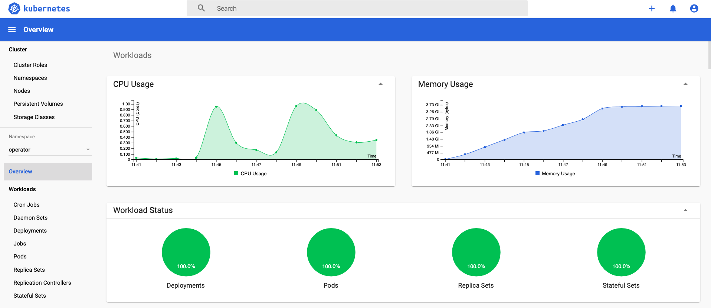

# Check Confluent Cluster

If you did run already `terraform apply` in [terraform/aws](terraform/aws) or [terraform/gcp](terraform/gcp) then you deployed the following objects:
* K8s dashboard / Service Account
  * For GCP `kubectl apply -f k8s-admin-service-account.yaml`was executed during terraform apply (see `terraform/agcp/00_setup_GKE.sh`)
  * For AWS `kubectl apply -f k8s-admin-service-account.yaml`was executed during terraform apply (see `terraform/aws/00_setup_EKS.sh`)
  * For Azure `kubectl apply -f k8s-admin-service-account.yaml`was executed during terraform apply (see `terraform/azure/00_setup_AKS.sh`)
* Create Token
  * GCP: Create token `kubectl -n kubernetes-dashboard describe secret $(kubectl -n kubernetes-dashboard get secret | grep admin-user | awk '{print $1}')`
  * AWS: Create token `kubectl -n kube-system describe secret $(kubectl -n kube-system get secret | grep admin-user | awk '{print $1}')`
  * Azure: Create token `kubectl -n kube-system describe secret $(kubectl -n kube-system get secret | grep admin-user | awk '{print $1}')`
* Run `kubectl proxy`
* Go to [K8s dashboard](http://localhost:8001/api/v1/namespaces/kubernetes-dashboard/services/https:kubernetes-dashboard:/proxy/): HINT: on MacOS Chrome is not working. I use Firefox.
* Login to K8s dashboard using the token from `kubectl -n kubernetes-dashboard describe secret $(kubectl -n kubernetes-dashboard get secret | grep admin-user | awk '{print $1}')`
Note: Please check your browser: with Chrome I got the message, after login with token: Mark cross-site cookies as Secure to allow setting them in cross-site contexts. With Safari I do not got a problem. And please after you are finish with your demo, check if kubectl proxy is running: `ps -ef | grep proxy`. If yes, kill the process `kill -9`

The k8s Dashboard will show for namespace operator the following :

k8s_dsahboard.png


## Quick Start

Ensure your k8s cluster is running:
  * GCP
```bash
gcloud container clusters list
```
  * AWS
```bash
eksctl get cluster 
```
  * Azure
```bash
az aks list
# or az aks show -n ${CLUSTER} -g ${RESOURCEGROUP}
az aks show -n cp60-cluster -g azure-cp60
```


The following setup was provisioned:


## test confluent platform on k8s
First which namespaces are setup:
```bash
kubectl get namespace
```

After the script execution please check again if Confluent Platform cluster is running:
```bash
kubectl get pods -n operator
# Output should look like this
NAME                           READY   STATUS    RESTARTS   AGE
cc-operator-66cf47bcbd-lxtcm   1/1     Running   1          26m
connect-0                      1/1     Running   0          22m
controlcenter-0                1/1     Running   0          15m
kafka-0                        1/1     Running   0          25m
kafka-1                        1/1     Running   0          25m
kafka-2                        1/1     Running   0          25m
ksql-0                         1/1     Running   0          20m
schemaregistry-0               1/1     Running   0          24m
zookeeper-0                    1/1     Running   0          26m
zookeeper-1                    1/1     Running   0          26m
zookeeper-2                    1/1     Running   0          26m
```
Check the services
```bash
kubectl get services -n operator
```
Check the nodes of k8s cluster
```bash
# get  Nodes
kubectl get node
```
Check events happening during deployment:
```bash
# List Events sorted by timestamp
kubectl get events --sort-by=.metadata.creationTimestamp -n operator
kubectl get events -n operator
```

## Access the Pods directly

Access the pod into broker kafka-0:

```bash
kubectl -n operator exec -it kafka-0 bash
```

All Kafka brokers should have a config file like the following:

```bash
cat kafka.properties
bootstrap.servers=kafka:9071
sasl.jaas.config=org.apache.kafka.common.security.plain.PlainLoginModule required username="test" password="test123";
sasl.mechanism=PLAIN
security.protocol=SASL_PLAINTEXT
```

Query the bootstrap server:

```bash
kafka-broker-api-versions --command-config kafka.properties --bootstrap-server kafka:9071
# check version
kafka-topics --command-config kafka.properties --bootstrap-server kafka:9071 --version
```

Create topic and fill with some data;
```bash
kafka-topics --bootstrap-server kafka:9071 \
--command-config kafka.properties \
--create --replication-factor 3 \
--partitions 6 --topic example
# list topic
kafka-topics --bootstrap-server kafka:9071 \
--command-config kafka.properties \
--list
# produce data
seq 10000 | kafka-console-producer --topic example --broker-list kafka:9071 --producer.config kafka.properties
# Describe topic example
kafka-topics --bootstrap-server kafka:9071 \
--command-config kafka.properties \
--describe --topic example
```
The topic example is very good shared among the brokers:
```
Topic:example   PartitionCount:6        ReplicationFactor:3     Configs:min.insync.replicas=2,message.format.version=2.3-IV1,max.message.bytes=2097164
        Topic: example  Partition: 0    Leader: 1       Replicas: 1,2,0 Isr: 1,2,0
        Topic: example  Partition: 1    Leader: 2       Replicas: 2,0,1 Isr: 2,0,1
        Topic: example  Partition: 2    Leader: 0       Replicas: 0,1,2 Isr: 0,1,2
        Topic: example  Partition: 3    Leader: 1       Replicas: 1,0,2 Isr: 1,0,2
        Topic: example  Partition: 4    Leader: 2       Replicas: 2,1,0 Isr: 2,1,0
        Topic: example  Partition: 5    Leader: 0       Replicas: 0,2,1 Isr: 0,2,1
...
exit
```


### Test KSQL (Data Analysis and Processing)

Go into the KSQL Server and play around with KSQL CLI:

```bash
kubectl -n operator exec -it ksql-0 bash
$ ksql
ksql> list topics;
ksql> PRINT 'example' FROM BEGINNING;
ksql> list streams;
ksql> list tables;
ksql> exit
exit
```
The script already creates some KSQL Streams and Tables (JSON-to-AVRO Conversion; and a few SELECT Queries). Take a look at these queries or write your own from KSQL CLI or Confluent Control Center.

## External Access to your Confluent Plaform

### Test Control Center (Monitoring) with external access

Use your browser and go to [http://controlcenter:9021](http://controlcenter:9021) enter the Username=admin and Password=Developer1.

This will not work, because no external access was setup.

Please follow the use case for Loadbalancers in this project [README_LB.md](README_LB.md)

HINT: Please follow the Confluent documentation [External Access](https://docs.confluent.io/current/installation/operator/co-endpoints.html#co-loadbalancer-kafka). 


## Confluent Platform on Kubernetes

For more details, follow the examples of how to use and play with Confluent Platform on GCP K8s on [Confluent docs](https://docs.confluent.io/current/installation/operator/co-deployment.html)

